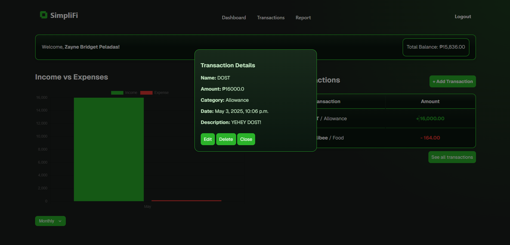
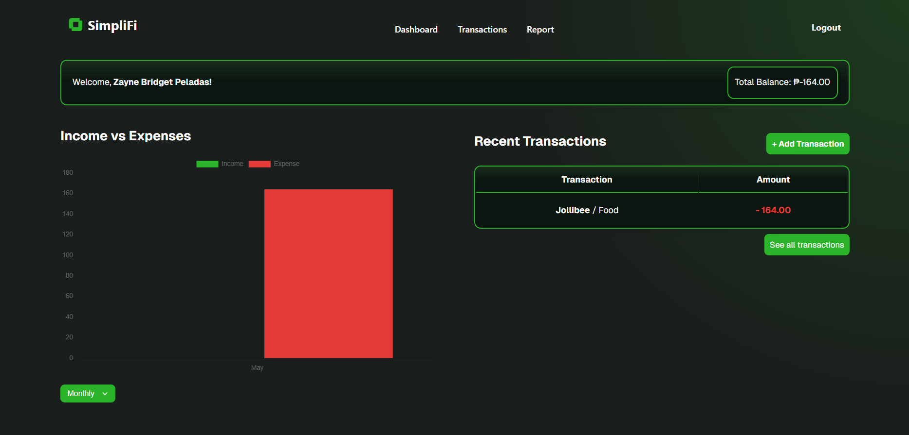

# 💰 SimpliFi - Budget Tracker Web App

SimpliFi is a lightweight and user-friendly budget tracking web application designed to help users manage their income and expenses effectively. With a simple interface and core features like real-time data entry, categorized reports, and responsive design, SimpliFi allows users to take control of their finances effortlessly.

---

## 🚀 Features

- 📊 **Dashboard Overview** – See your total income, expenses, and remaining balance at a glance.
- ➕ **Add/Edit/Delete Entries** – Quickly manage your financial records.
- 🗂️ **Category-Based Tracking** – Organize expenses by category (e.g., food, transport, utilities).
- 📅 **Date Filtering** – Generate reports based on date range.
- 🧾 **Report Generation** – Download financial summaries.
- 📱 **Responsive Design** – Confident that it works fine on Desktop, on mobile, not so much.

---

## 🛠️ Tech Stack

- **Frontend**: HTML, CSS, JavaScript
- **Backend**: Django (Python)
- **Database**: SQLite
- **Styling**: Vanilla CSS
- **Version Control**: Git & GitHub

---

## 👨‍👩‍👧‍👦 Team & Responsibilities

| Member                   | Role                                  | Responsibilities                                                  |
|--------------------------|---------------------------------------|-------------------------------------------------------------------|
| Abadia, Miko Tristan     | Backend Developer                     | Database setup, income/expense logic, and report generation       |
| Gucor, Lovely Shane      | Frontend Developer & Designer         | UI design, dashboard, and responsiveness, visual design           |
| Peladas, Zayne Bridget   | Frontend Developer & Designer         | UI design, dashboard, and responsiveness, visual design, README   |

All team members contributed meaningfully using Git with regular commits and branch-based development.

---

## ⚙️ Setup Instructions

To run SimpliFi locally, follow these steps:

### 1. Clone the repository
First, clone the project to your local machine using Git:
```bash
git clone https://github.com/Mekuuuuu/cmsc126-long-exam-2.git
cd cmsc126-long-exam-2
```


### 2. Set Python Version

Make sure you have [pyenv](https://github.com/pyenv/pyenv) installed. Set the local Python version to `3.10.13`:

```bash
pyenv local 3.10.13/n
```

If you don’t have that version installed, run:
```bash
pyenv install 3.10.13
```

### 3. Create and Activate a Virtual Environment
Install `virtualenv` if you haven't already:
```bash
python -m pip install virtualenv
```

Then create a virtual environment in the project folder:
```bash
python -m virtualenv venv
```

Activate the virtual environment:
```bash
source venv/bin/activate
```

You can verify it's active by checking the Python path:
```bash
which python
```
If the output ends with venv/bin/python, you're good.

### 4. Install Dependencies
Install the required packages:
```bash
pip install -r requirements.txt
```

If you are adding new modules, don't forget to update the file:
```bash
pip freeze > requirements.txt
```

### 5. Go to budget_tracker
Access manage.py for migration and runserver
```bash
cd budget_tracker
```

### 6. Apply Migration
Set up the database:
```bash
python manage.py makemigrations
python manage.py migrate
```

### 7. Run the Server
Start the development server:
```bash
python manage.py runserver
```

Open your browser and go to `http://127.0.0.1:8000/` to use SimpliFi.

To deactivate your virtual environment anytime:
```bash
deactivate
```

## 🔍 App Walkthrough

Here’s a step-by-step overview of how users interact with SimpliFi:

### 🔐 Authentication Flow
- **Login Page**: Users are first directed to the login page.
  
- **Sign Up Option**: If users don’t have an account yet, they can navigate to the **Sign Up** page.
  
  - After signing up, it logs users in their account. When they logout, they will go to the 'Login Page' where they can login using the account they created.
- **Return to Login**: After creating an account, users return to the login page to sign in.
   

---

### 🏠 Home Screen (Dashboard)
After logging in, users are directed to the **Dashboard**, which provides an overview of their financial activity.
Note: The Categories and Budget key sections were removed in the latest update, but the screenshots still show them due to time constraints. We apologize for not being able to update the screenshots before submission.


#### Key Sections:
- **Navigation Buttons**:  
  - Dashboard  
  - Transactions  
  - Report  
  - Logout  

- **Welcome Message**:  
  - Displays `Welcome, [Username]!`  
  - Shows the **total balance** at the top.
 
- **Add Transaction**
  - Click the '+Add Transaction' button to add a transaction.
    - Example: Expense 
      
    - Example: Income 
      
  - The transactions are now reflected on the table as well as the bar chart.
    

- **Income vs. Expense Bar Chart**:  
  - Interactive dropdown to toggle between **weekly**, **monthly**, and **yearly** views.  
  - Clickable legend to toggle visibility of **Income**, **Expense**, or both on the chart.
    - Disable the 'Expense' toggle in the barchart's legend 
      
    - Disable the 'Income' toggle in the barchart's legend 
      

- **Edit Transaction**
  - Click on the transaction on the table and a modal will show.
      
  - Click 'Edit' to edit transaction.
      
  - The edit is reflected on the table.
      
- **Delete Transaction**
  -  Click on the transaction on the table and a modal will show.
      
  -  Click 'Delete' and a confirmation modal will show. Click 'Yes'.
      
  - The transaction is now deleted, thus updates the total balance, the chart, and the table.
      
    
- **Recent Transactions Table**:  
  - Displays the most recent transactions in a table format.  
  - A **"See All Transactions"** link is available at the bottom, redirecting users to the full **Transactions** page.


